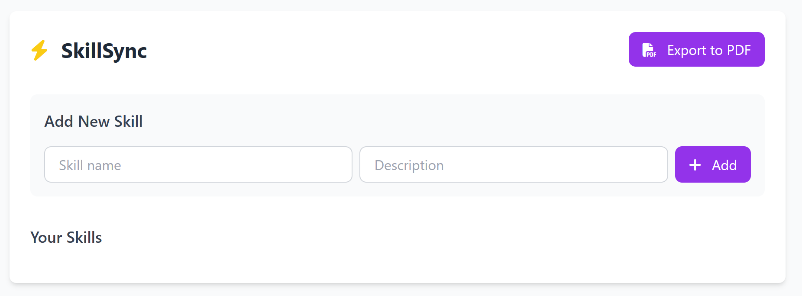

# SkillSync - Personal Skill Management App

SkillSync is a simple web application that helps you track and manage your skill development progress. It allows you to add, edit, and delete skills, track your progress, and export your skills report as a PDF.

## Features

- **Add Skills**: Track new skills you want to learn or improve
- **Progress Tracking**: Set and update your progress (0-100%) for each skill
- **Visual Progress Bars**: See your progress at a glance with colored bars
- **Skill Descriptions**: Add notes about each skill
- **Local Storage**: Your skills are saved automatically in your browser
- **PDF Export**: Generate a clean PDF report of your skills
- **Responsive Design**: Works on both desktop and mobile devices

## Technologies Used

- HTML5
- CSS3 (with Tailwind CSS)
- JavaScript
- LocalStorage API
- jsPDF (for PDF generation)
- html2canvas (for converting HTML to PDF)
- Font Awesome (for icons)

## Installation

No installation required! SkillSync runs directly in your web browser.

click on this link : https://alammarimalak.github.io/skillSync/ 

## How to Use

1. **Add a New Skill**:
   - Enter the skill name and description in the input fields
   - Click "Add" or press Enter

2. **Edit Skill Progress**:
   - Click the "Edit" button next to any skill
   - Enter a new progress value (0-100)
   - Click OK to update

3. **Delete a Skill**:
   - Click the "Delete" button next to any skill
   - Confirm the deletion when prompted

4. **Export to PDF**:
   - Click the "Export to PDF" button
   - A clean PDF report will be generated and downloaded automatically

---

